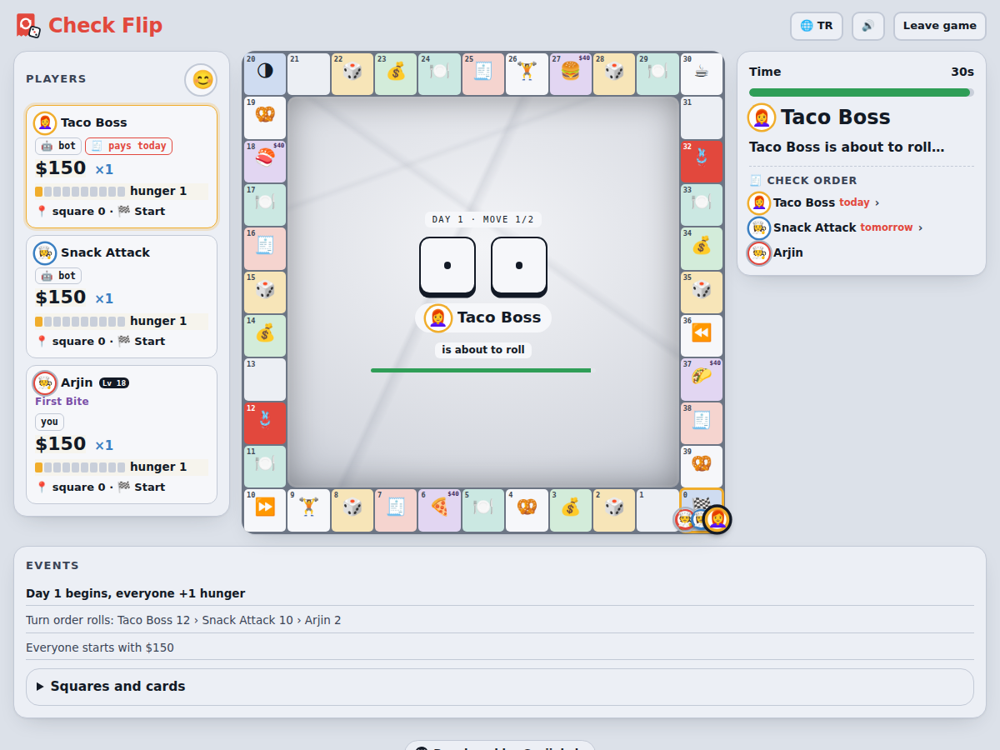

<p align="center">
  
</p>

<h1 align="center">Check Flip</h1>

<p align="center">
  <b>Flip the check. Make them pay.</b><br>
  A free, install-free multiplayer browser board game for 2–6 players about dice, cards and who picks up the check.<br>
  Play with friends, join a quick game, or play solo against bots.
</p>

<p align="center">
  <a href="https://checkflipgame.com"><b>▶ Play at checkflipgame.com</b></a>
  &nbsp;·&nbsp; English / Türkçe
</p>



## About the game

It looks like Monopoly, but the goal isn't to get rich. It's to **stay hungry and make others pay for dinner**. At the end of every day, the next player in line buys dinner for the whole table. The check grows with each player's hunger and multiplier. Whoever can't pay leaves the table, and the last one standing wins.

### Rules

- **Starting money** depends on the player count: 2 players $100, 3 players $150, 4+ players $200. The host can change it. Everyone starts with 0 hunger, and turn order is decided by a dice roll.
- **One day:** Everyone makes 2 moves. After rolling, you choose to move the sum of both dice or just one of them. Doubles roll again.
- Every day starts with **+1 hunger** for everyone (max 10).
- **Full lap:** +$40, +2 hunger, multiplier +1. **Halfway:** +$20, +1 hunger.
- **The check:** The next player in line pays `hunger × multiplier × $5` for everyone at the table, themselves included. Everyone who eats goes back to 0 hunger.
- **Restaurants** (🍕 Pizzeria, 🍣 Sushi Bar, 🍔 Burger Joint, 🌮 Taqueria):
  - Buy one for $40.
  - Landing on someone else's restaurant costs a visit fee ($5 / $8 / $12). You may then offer to buy it for more; if the owner accepts, it changes hands.
  - Landing on your own lets you cash the register (★ +$15, ★★ +$20, ★★★ +$25) or upgrade it.
  - Dinner is served at one of the 4 restaurants **at random**. If it has an owner, they take a commission from the check: ★ 25%, ★★ 35%, ★★★ 50%.
- **Negotiation:** The payer gets one offer: "I'll give you $X, you pay the check."
- **Cards:**
  - Chance and Event decks.
  - Some cards are kept in hand (max 2): Free sample, Hunger pangs, Discount coupon, Pass the check, Going Dutch.
  - Tighten the Belt (squares 12 and 32) lets the payer skip their own meal and share.
- **Timer:** 30 seconds to decide, 45 seconds to pay. If time runs out or a player disconnects, the game plays for them.
- **Day limit (optional):** When time is up, the richest player (*money + restaurant value*) wins.
- **Accounts (optional):** Logged-in players earn XP and unlock achievements and cosmetics. **Games with bots (single player, or bots added to a room) give half XP and don't count toward achievements** (except level achievements). Wins and other achievements come from online games once another player at the same table confirms the result. Games shorter than 3 days or 4 minutes don't count.

### Features

- **Game modes:**
  - Private room: join with a 5-character code or an invite link. The host can add bots to fill empty seats.
  - Quick game: random matchmaking. The table starts at 4 players, or when everyone is ready.
  - Single player: 2, 3 or 4-player tables against bots.
  - **Modes:** Classic (last one standing), **Quick** (10 days, shorter turn timers, richest wins, ~15 minutes) and **2v2 teams** (seats 1 & 3 against 2 & 4; teammates cover each other's checks; knock out both rivals to win).
  - **Rematch:** everyone taps *Rematch* and a new game starts with the same settings.
  - Same device: pass the phone around.
- **Accounts and progression (optional):**
  - Sign up with a username and password. The e-mail is optional and only used for password resets. Guests can still play everything.
  - XP and levels (1–99). Level 10 takes about 530 XP, level 50 about 15,600 XP.
  - 24 achievements, each unlocking a title and most a cosmetic (see below).
  - **Profile & looks** screen with tabs: Avatar, Frames, Boards, Chat bubbles, Titles, Achievements, Stats.
  - Avatar frames and titles are shown to everyone at the table; chat bubbles to everyone in the room; board styles only to you.
- **Social (with an account):**
  - **Friends:** add by username, accept requests, see profile cards (level, wins, win rate, achievements).
  - **Invites:** invite friends to your private room with one tap; they get a *Join* pop-up, no code needed.
  - **Leaderboards:** this week's online wins (resets Monday 00:00 UTC) and all-time level.
  - **Daily quest:** one small goal per day for everyone (+30 XP).
- **Share your result:** a result card image for WhatsApp, Instagram etc. (or a download on desktop).
- **First-game guide:** short tips appear once, at the moment they matter; they can be hidden or shown again.
- **Installable app (PWA):** "Install app" on Android/desktop, "Add to Home Screen" on iPhone; loads fast and single player works offline.
- **Music:** two tracks generated in the browser: a light, sneaky tiptoe tune on the menus and a calm lounge loop during play. They cross-fade when a game starts or ends. The music button turns both off; sound effects are separate.
- **Light and dark theme:** the moon / sun button next to the sound button switches themes. The first visit follows the device setting, after that your choice is remembered.
- **Link previews:** invite links show the game's image and title in chat apps.
- **Two languages:** English by default, Turkish via the 🌐 button. In online games each player sees the game log in their own language.
- **Avatars:** 12 original illustrated characters (waiter, waitress, student, food blogger, Italian chef, döner master, noodle chef, pastry chef, grandma, food critic, barista, sommelier). Four are open from the start, the rest unlock with levels and achievements. An avatar taken by one player can't be picked by another; players without one get a colored letter token. The illustrations are generated by `tools/avatars/make_avatars.py`.
- **Bots:** They score target squares, time their hunger around the check order, buy and upgrade restaurants, and use cards and negotiation. In simulations they win about 90% of games against random players.
- **Connection resilience:** A dropped player rejoins with the same link. If the host drops, another player takes over the room.
- **Privacy:** A bilingual privacy notice (KVKK / GDPR), consent at sign-up and self-service account deletion.
- **Social:** Chat and emoji reactions.
- **Look and sound:** Dice and token animations, sound effects synthesized with WebAudio (no audio files).
- **Mobile:** On phones the game fits one screen. Large content (the check, offers) opens in a bottom sheet.

### Progression

**XP per counted game:** 20 for playing + 10 per player you finished ahead of + 50 for a win + up to 20 for days survived, capped at 150. Games with bots give half.

| Achievement | Goal | Unlocks |
|---|---|---|
| 🍽️ First Bite | Win an online game | Title, *Grandma* avatar, *Sweetheart* chat bubble |
| 🪑 Regular | Win 10 online games | Title, *Food critic* avatar, *Golden* chat bubble |
| 🏆 Gourmet | Win 100 online games | Title, *Flame* frame |
| 🎖️ Veteran | Play 50 online games | Title |
| 🔪 Sous Chef | Reach level 10 | Title |
| 👑 Head Chef | Reach level 50 | Title |
| 🤝 Negotiator | Pass the check on with a deal 10 times | Title, *Neon* frame |
| 🪢 Belt Master | Use Tighten the Belt 20 times | Title |
| 🦾 Iron Stomach | Pay a check of $300+ and stay at the table | Title, *Ocean* board |
| 🏙️ Tycoon | Own all 4 restaurants at ★★★ in one game | Title, *Royal* frame |
| 🍳 Line Cook | Reach level 25 | Title, *Ember* frame |
| 🎩 Executive Chef | Reach level 75 | Title, *Crown* frame |
| 🏃 Marathoner | Play 200 online games | Title, *Sommelier* avatar |
| 🏪 Restaurateur | Buy 25 restaurants | Title, *Bistro awning* board |
| 🔨 Renovator | Upgrade restaurants 15 times | Title, *Ivy* frame |
| 🃏 Card Shark | Play 50 cards | Title, *Card suits* chat bubble |
| 💳 Big Spender | Pay 30 checks | Title, *Gold leaf* board |
| 💼 Deal Maker | Pass the check on with a deal 50 times | Title, *Starry* frame |
| ⏳ Survivor | Stay at the table for 20 days in one game | Title, *Zen* chat bubble |
| 👥 Team Player | Win 5 2v2 games | Title, *Duo* frame |
| ⚡ Speed Eater | Win 5 Quick games | Title, *Zoom* chat bubble |
| 💬 Social Butterfly | Have 5 friends | Title, *Mint* chat bubble |
| 🎯 Quester | Complete 10 daily quests | Title, *Barista* avatar |
| 📅 Regular Guest | Complete 30 daily quests | Title, *Lavender* board |

Game-based counters (restaurants, cards, checks, deals, days, mode wins) only grow from online games confirmed by another player; games with bots never count.

**Level unlocks:** avatars Italian chef (5), Döner master (10), Noodle chef (15), Pastry chef (25) · frames Bronze (5), Silver (15), Gold (30), Diamond (50) · boards Navy felt and Sweet hearts (start), Oak (3), Feast (6), Terracotta (10), Marble (15), Sunset (20), Midnight (25), Chalkboard menu (30), Neon diner (35) · chat bubbles Receipt (4), Comic (8), Neon (25).

## How it works

```
                 checkflipgame.com  (one Cloudflare Worker)
 ┌────────────┐  static files ──────────────► public/  (free, no Worker run)
 │  Browser   │  /ws?hub=ROOM ─────────────► Durable Object "Hub" per room
 │  (game)    │                               relays moves, chat, presence
 └─────┬──────┘                               └─ fallback: public MQTT brokers
       │ accounts, XP, achievements
       ▼
   Supabase (Auth + Postgres, sql/schema.sql)   ◄── daily keep-alive cron
```

- **The game runs in the browser.** The host's browser applies the rules (`public/js/engine.js`) and shares the game state. If the host drops, another player takes over.
- **Multiplayer relay:** each room is a Cloudflare **Durable Object** (`worker/index.js`). It relays messages between the players of a room, keeps the latest game state for 12 hours so players can reconnect, and notices when a player disconnects. It uses the WebSocket Hibernation API, so idle rooms cost nothing.
- **Fallback:** if the relay can't be reached (or the free daily quota is used up), the game automatically connects through public MQTT brokers (EMQX, HiveMQ, Mosquitto) with the same logic. This also works in the middle of a game: when the relay drops, players add a backup connection to a public broker and messages go over both until the game ends.
- **Quick game:** open public tables are listed in a separate `_pub` hub; a table disappears from the list when it fills up, starts or everyone leaves.
- **Accounts:** Supabase Auth + Postgres. Clients can only read; every write goes through validated database functions (see [Security](#security)).
- **Keep-alive:** a daily cron trigger in the same Worker makes a small read from Supabase, so the free project isn't paused after a week without activity.

### Project structure

```
.
├── public/                 # the game (served as static files)
│   ├── index.html
│   ├── privacy.html        # privacy notice (KVKK / GDPR), English + Turkish
│   ├── sw.js               # service worker (offline cache)
│   ├── manifest.webmanifest
│   ├── css/style.css
│   ├── assets/             # logo, screenshot, og.png (link preview), icons/ (app icons), avatars/
│   └── js/
│       ├── engine.js       # rules, balance values, bot AI (no DOM; runs in Node too)
│       ├── app.js          # networking, animation, UI, chat
│       ├── net.js          # client for the Cloudflare relay (mqtt.js-compatible subset)
│       ├── account.js      # Supabase client: auth, XP/levels, achievements, cosmetics
│       ├── account-ui.js   # log in / sign up / reset, Profile & looks, end-of-game progress
│       ├── i18n.js         # English + Turkish game texts
│       ├── i18n-account.js # English + Turkish account texts
│       ├── config.js       # Supabase URL + publishable key (public values)
│       ├── sound.js        # WebAudio sound effects
│       ├── music.js        # generated background music (menu + game tracks)
│       ├── social-ui.js    # friends, leaderboards, profile cards, invites
│       ├── tips.js         # first-game guide
│       ├── share.js        # result card image
│       ├── pwa.js          # install prompt + service worker registration
│       ├── i18n-v11.js     # texts added in v1.1
│       ├── i18n-v13.js     # texts added in v1.3 (home screen, theme)
│       └── version.js      # version number (shown in the footer)
├── worker/index.js         # Cloudflare Worker: static site, room relay (Durable Object), cron
├── wrangler.jsonc          # Worker configuration
├── sql/schema.sql          # Supabase database: tables, security rules, functions
├── tests/simulate.mjs      # engine simulation (hundreds of bot games)
├── tools/avatars/          # generator for the avatar illustrations (Python, no dependencies)
├── tools/email-templates/  # password-reset e-mail for Supabase
└── tools/netlify-redirect/ # optional: redirect an old Netlify address to the new domain
```

### Free-tier limits (Cloudflare Workers free plan)

| | Free per day | What it means here |
|---|---|---|
| Static files | unlimited | Loading the game never counts. |
| Worker requests | 100,000 | One per player connection. |
| Durable Object requests | 100,000 | WebSocket messages count 20:1, i.e. ~2 million game messages. |
| Durable Object duration | 13,000 GB-s | About **29 room-hours of active play per day** (≈ 55 half-hour games). Idle rooms hibernate. |

When a limit is reached, new rooms and running games fall back to the public MQTT brokers until the quota resets (00:00 UTC). If the game outgrows this, the Workers Paid plan costs $5/month.

## Deploying

### 1. Supabase (accounts)

1. Create a free project at [supabase.com](https://supabase.com).
2. **SQL Editor → New query:** paste all of `sql/schema.sql` and **Run**. Run it again after every update of the file; it's safe to re-run.
3. **Authentication → Sign In / Providers → Email:** keep the Email provider on and turn **Confirm email off** (accounts without an e-mail can't confirm one).
4. **Authentication → URL Configuration:** *Site URL* `https://checkflipgame.com`; add `https://checkflipgame.com` and `https://www.checkflipgame.com` to *Redirect URLs* (password-reset links return there).
5. **Password-reset e-mails:** the built-in mailer only delivers to your own team's addresses and a few mails per hour. For real players, use a custom SMTP server, e.g. [Resend](https://resend.com) (free: 3,000 e-mails/month):
   - Resend → **Domains → Add domain** `checkflipgame.com` and add the DNS records it shows (Resend can add them to Cloudflare automatically). They live on the `send.` subdomain, so they don't clash with Email Routing.
   - Resend → **API Keys → Create** (permission: *Sending access*).
   - Supabase → **Authentication → Emails → SMTP Settings → Enable custom SMTP**: sender `noreply@checkflipgame.com`, name `Check Flip`, host `smtp.resend.com`, port `465`, username `resend`, password = the API key.
   - Optional: paste `tools/email-templates/reset-password.html` into **Emails → Templates → Reset Password** for a bilingual e-mail.
6. Put the *Project URL* and *publishable key* (Project Settings → API Keys) into `public/js/config.js` and into `vars` in `wrangler.jsonc`.

Never put the **secret / service_role key** or the database password anywhere in this repository.

### 2. Cloudflare (hosting + relay)

1. Push this repository to GitHub.
2. Cloudflare dashboard → **Workers & Pages → Create → Import a repository** → connect GitHub and pick the repo.
   - Project name: `check-flip` (must match `name` in `wrangler.jsonc`)
   - Build command: *leave empty* · Deploy command: `npx wrangler deploy`
3. **Deploy.** The game appears at `check-flip.<your-subdomain>.workers.dev`. Every push to `main` deploys again.
4. Worker → **Settings → Domains & Routes → Add → Custom domain:** add `checkflipgame.com` and `www.checkflipgame.com`. If the domain has older A/CNAME records (e.g. for Netlify), delete them first.
5. **E-mail for the privacy notice:** Cloudflare → your domain → **Email → Email Routing** → create `contact@checkflipgame.com` and forward it to your personal inbox (free).

### 3. Search and statistics (optional)

- **Google Search Console:** add a *Domain* property for `checkflipgame.com` and verify it with the TXT record Google shows (DNS → Records in Cloudflare, or Google's automatic Cloudflare verification). Then submit `https://checkflipgame.com/sitemap.xml`. `public/robots.txt` and `public/sitemap.xml` are included.
- **Cloudflare Web Analytics:** Cloudflare → **Analytics & Logs → Web Analytics → Add a site** → `checkflipgame.com` → automatic setup. Cookieless, so no consent banner is needed; it's listed in the privacy notice.

### 4. Moving away from an old host (optional)

To keep old links working, deploy the two files in `tools/netlify-redirect/` to the old Netlify site (drag the folder onto the site's *Deploys* page). Every old link then redirects to `checkflipgame.com`.

## Running locally

```bash
npm install
npm run dev        # Worker + relay + site at http://localhost:8787
npm test           # engine simulation
```

`npm start` serves only the static files (no relay); multiplayer then uses the public MQTT fallback. ES modules don't load over `file://`, so always use a local server.

## Tests

`npm test` plays hundreds of 2–6 player games with random-choice players and checks for stuck games and invalid states, pits the bot AI against random players, and checks the final standings used for account results:

```
4 players: 300/300 games finished, errors 0, median days 19 (p10 16, p90 23)
Bot AI, 4-player table (1 bot + 3 random players): win rate 92% (chance alone: 25%), errors 0
All simulations passed.
```

Run it after changing balance values (the constants at the top of `public/js/engine.js`).

## Security

- Passwords are handled by Supabase Auth (bcrypt); the browser only has the *publishable* key.
- Tables are **read-only** for clients (Row Level Security). Writes go through `SECURITY DEFINER` functions in `sql/schema.sql`:
  - `submit_result`: ignores duplicate submissions, caps XP per game, doesn't count games shorter than 3 days or 4 minutes, and allows at most one counted game per 4 minutes and 12 per hour. Place and a digest of the final standings are computed on the server.
  - **Cross-check:** an online result first gives participation XP only; the rest of the XP, the win and achievement progress are granted when another player of the same table submits the same final standings.
  - Achievements are awarded by a database trigger whenever XP, wins, games or stats change.
  - Friends, requests and invites are only reachable through functions: invites go to friends only (max 20 per 10 minutes, expire after 10 minutes), requests are rate-limited, and daily quest XP is granted once per UTC day by the server.
  - `set_equipped` refuses cosmetics that aren't unlocked. `login_email` allows username login without revealing e-mails and is throttled. `delete_my_account` deletes the caller's account and all its data.
- The relay only lets a connection publish and subscribe inside its own room, limits message size and rate, and only accepts browser connections from the game's own domain (plus `ALLOWED_ORIGINS`).
- Anti-cheat is "trust + limits": the rules run in the host's browser, so a determined cheater with two accounts could fake a game; the limits keep the effect small.

## Privacy

`public/privacy.html` is the privacy notice (KVKK and GDPR, English and Turkish). Sign-up requires accepting it, and players can delete their account in *Profile & looks → Stats*. No tracking or advertising cookies are used; only local storage needed for the game (language, nickname, session). If ads are added later, a consent banner (CMP) is required for visitors from the EU/UK.

## Adding a language

Game texts live in `public/js/i18n.js`, account texts in `public/js/i18n-account.js`. Add a language key next to `en` and `tr` in each dictionary, add it to `LANGS`, and extend the language button in `public/js/app.js`.

## History

The game started as “Hesaplar Senden”, became “Hesap Kimde?”, then “Check, Please!”, and is now **Check Flip**. A few internal identifiers (the relay topic prefix `checkplease/v1/` and the placeholder e-mail domain) keep the old name on purpose so existing rooms and accounts keep working.

## Changelog

### 1.4.1
- Fix: after a Hop in a taxi / Got lost / shortcut / go back move, the token now visibly moves after the card is shown (before, the whole move played at once and looked like the card did nothing)
- Bots take about 2 seconds longer per move, and their result pop-ups stay as long as a person's, so the table is easier to follow

### 1.4.0
- Profile: opens on Stats (now the first tab), a new header card, and you can add or change your e-mail for password resets
- Titles are no longer all purple: each has its own badge (green, blue, red, stamped yellow, shining gold, neon, royal, fire)
- New look for the lobby (room card and players on the left, settings on the right), leaderboard, friends and the end-of-game card with final standings
- Log out moved to the top right, next to your account button
- Backup connection in the middle of a game: if the game server can't be reached (or a player drops off it), everyone also joins the room on a public MQTT broker and the game goes on

### 1.3.2
- Wide screens: players and chat on the left, board in the middle, your turn on the right; compact player cards so 5–6 player tables fit
- Chat is the default tab, Events is one click away; the round chat button is gone on desktop
- Fix: icons and names on board squares overlapped
- Home: the account button (top right) now shows your level and XP bar and opens your profile; removed the duplicate account card and the extra Profile / How to play buttons; Friends button got an icon
- "Developed by" credit only on the home screen

### 1.3.1
- Fix: after an update, some browsers showed the new page with old cached scripts and styles (broken layout). Scripts and styles are now loaded network first, and the page reloads once when a new version takes over

### 1.3.0
- New home screen: one big Quick game button with a Classic / Quick switch, three tiles (with friends, against bots, same device) and a small strip for your account, daily quest, leaderboard and rules
- Quick game only seats you at open tables of the mode you picked
- Simpler header: icon buttons, an account chip with your avatar and level, and a light / dark theme toggle
- Game screen: board on the left, players, your turn and a Events / Chat switch in one column on the right
- Two background tracks: a playful tiptoe tune on the menus and the calm lounge loop in game

### 1.2.0
- 14 new achievements (24 in total) with new rewards: 5 frames, 3 boards, 4 chat bubbles, 2 avatars and a title for each
- Weekly leaderboard ranks by online wins
- Calmer background music
- Reaction button uses a drawn icon, perfectly centered on every device
- Password confirmation on sign-up and reset; specific error messages (same password, too short/long, expired link, e-mail limits…)

### 1.1.1
- `robots.txt`, `sitemap.xml` and a canonical link for search engines
- Privacy notice: visitor statistics (Cloudflare Web Analytics) and the e-mail provider (Resend)
- Bilingual password-reset e-mail template (`tools/email-templates/`)

### 1.1.0
- Game modes: Quick (10 days) and 2v2 teams
- Rematch, result share card, first-game guide
- Friends, profile cards, one-tap invites, weekly and all-time leaderboards, daily quests
- Installable app (PWA) with offline single player, link previews, background music
- Version shown in the footer

### 1.0.0
- First public release: online rooms and quick play, single player with bots, accounts with XP, achievements and cosmetics, illustrated avatars, board styles, Cloudflare hosting and relay

Updating the version: change `public/js/version.js` (and `package.json`). The service worker cache is named after it, so players get the new files.

## Author

Design and development: [@arjinkvlc](https://github.com/arjinkvlc)
